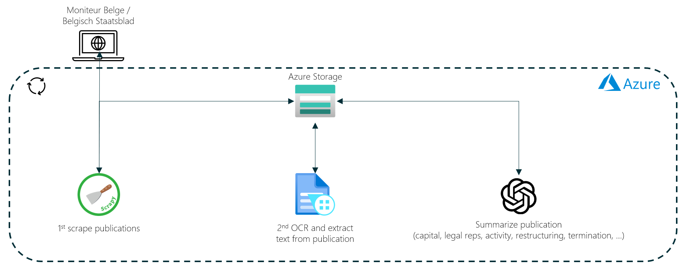

# Belgian Official Journal
Small pet project for playing around with [Belgian official journal](https://www.ejustice.just.fgov.be/cgi_tsv_pub/welcome.pl) (AKA Belgisch Staatsblad/Moniteur Belge). This repo implements a web-scraper to collect [company bylaws](https://corporatefinanceinstitute.com/resources/management/company-bylaws/), along with tools for text extraction and OCR (using Azure Document Intelligence), and summarization (using Azure OpenAI).

## Project setup
1. setup the environment by installing [environment.yml](environment.yml) 
`conda install -n belgian-journal -f environment.yml`
2. setup the `.env` file by filling in the [.myenv](.myenv) and renaming it to `.env`

## Running the project
There are two spiders in this repo that can be used to crawl the Belgian Journal.
1. `legal-entity-vat-spider`: takes a list of vats to scrape
2. `legal-entity-date-spider`: takes a daterange between which it will scrape (dates included)

Activate the virtual environment and then run `scrapy crawl legal-entity-vat-spider` or `scrapy crawl legal-entity-date-spider -a start_date=2023-01-01 -a end_date=2023-01-07`.

## Documentation
There is additional documentation on this project for the following topics:
- [scraping](documentation/scraping.md)
- [OCR](documentation/ocr.md)
- [text extraction](documentation/extract_text.md)
- [summarization](documentation/summarize.md)

## Visual overview

## Publications dataset
On [Hugging Face](https://huggingface.co/datasets/guust-franssens/belgian-journal) you can find a dataset that was created by crawling with the legal-entity-date-spider.

## Deployment
This project can be easily hosted in [Azure Container Instances](https://learn.microsoft.com/en-gb/azure/container-instances/). A docker image containing all the dependencies can be created using the [Dockerfile](Dockerfile). In here, pip in combination with [requirements.txt](requirements.txt) is used to keep the image light (~550 MBs). The [requirements.txt](requirements.txt) is a slimmed down version of [environment.yml](environment.yml) that only contains the bare minimum packages. 

A docker run can then be triggered using [Azure functions](https://learn.microsoft.com/en-us/azure/azure-functions/functions-overview) with a 
[timer trigger](https://learn.microsoft.com/en-us/azure/azure-functions/functions-triggers-bindings) to run `docker run belgian-journal:latest scrapy crawl legal-entity-date-spider -a start_date=2023-01-01 -a end_date=2023-01-01`
