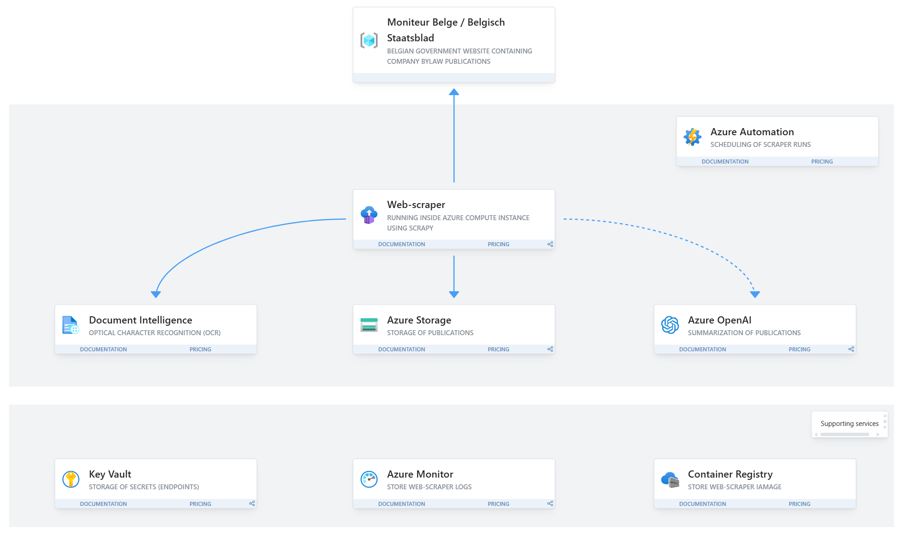

# Belgian Official Journal
Small pet project for playing around with [Belgian official journal](https://www.ejustice.just.fgov.be/cgi_tsv_pub/welcome.pl) (AKA Belgisch Staatsblad/Moniteur Belge).

## Project setup
1. setup the environment by installing [environment.yml](environment.yml) 
`conda install - belgian-journal -f environment.yml`
2. setup the `.env` file by filling in the [.myenv](.myenv) and renaming it to `.env`

## Running the project
Activate the virtual environment and then run `scrapy crawl legal-entity-spider`.

## Documentation
There is additional documentation on this project for the following topics:
- [scraping](documentation/scraping.md)
- [OCR](documentation/ocr.md)
- [Text extraction](documentation/extract_text.md)

## Visual overview

