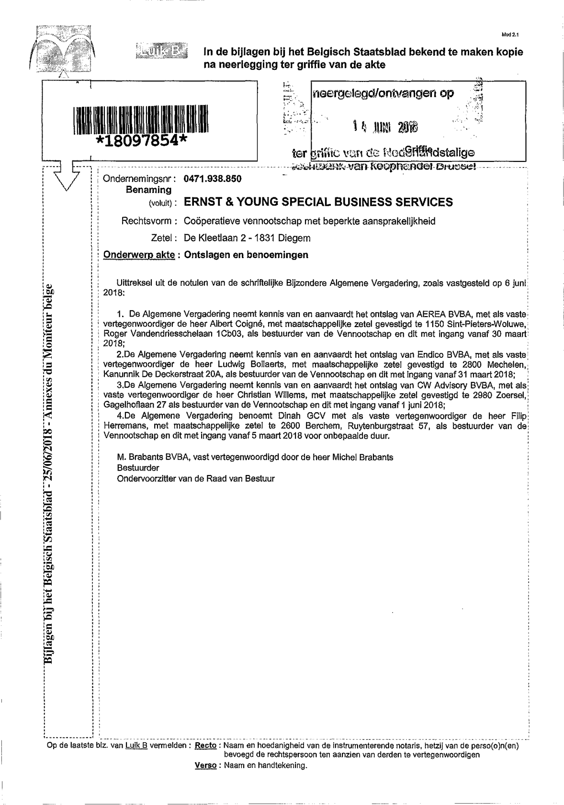
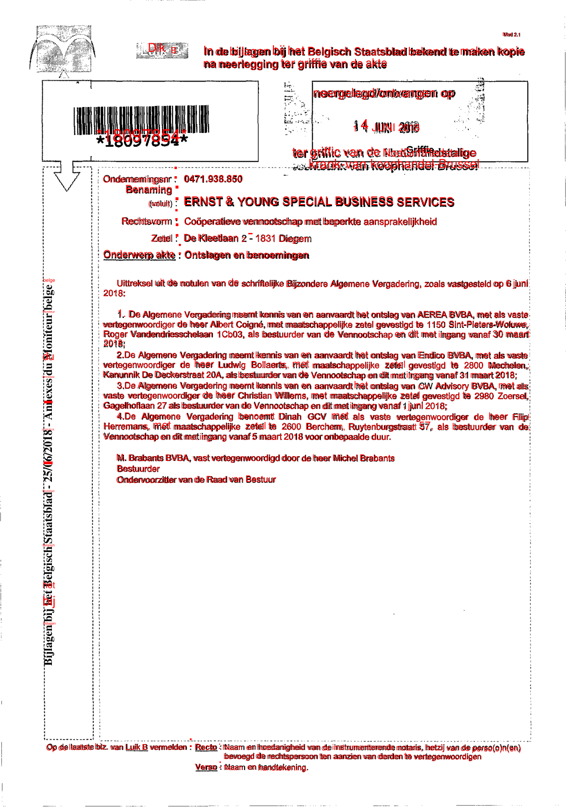

# Optical Character Recognition (OCR)
Usually the publications found on the Belgian Journal will be scans. In order to extract the text, the text in the image needs to be made searchable. This is done through Optical Character Recognition.

This repo uses Azure Document Intelligence OCR, which is used whenever the PDF available is not searchable:
- [image/scan example](https://www.ejustice.just.fgov.be/tsv_pdf/2024/05/08/24071723.pdf)
- [digital/searchable example](https://www.ejustice.just.fgov.be/tsv_pdf/2019/09/26/19335491.pdf)

## How to OCR
Here is a [demo notebook](ocr.ipynb) that can be used to turn a PDF into a searchable PDF. In the webscraper, the response of Azure is used without overlaying it over the PDF as the interest lies in the text and not the PDF. The table below shows the OCR'ed text overlayed in red on the image for demo purposes.

|  image/scan |  digitalised/made searchable |
|---|---|
|    |  |
